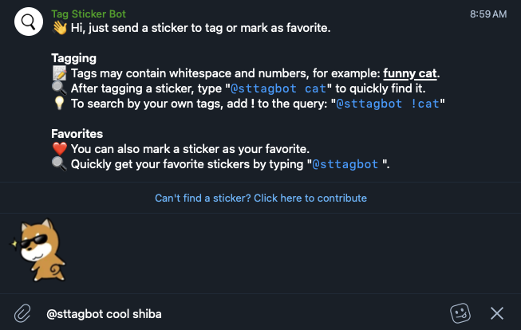

# Tag Sticker Bot

## Description

This bot enables users to tag stickers & GIFs, perform quick searches, and mark favorites directly within Telegram.

Features:
- 📝 Tag stickers & GIFs (up to 10 tags per file)
- 🔒 Create private tags for files that only you can search
- 🔍 Search files by your tags or all tags (inline query)
- 🖇 Quickly tag all stickers in a sticker set
- ❤️ Mark files as favorites for quick access
- 🖼 Create new stickers from photos or files

## Stack & tools
- Node.JS, AWS DynamoDB
- AWS CDK, Telegraf
- Rollup, Jest
- Telegram Bot API

## Commands
- `npm run setup-local` – set up local DynamoDB tables
- `npm run dev` – run bot locally
- `npm run deploy:prod` – deploy to AWS

## Documentation
Find detailed information about the project's architecture in [docs/architecture.md](docs/architecture.md).
